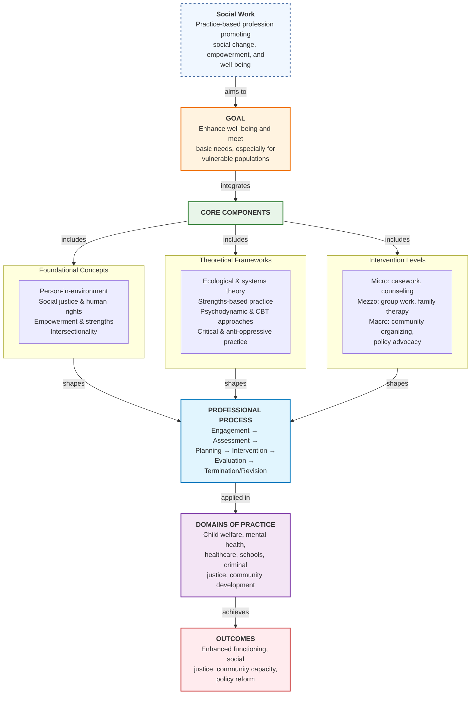

```mermaid
flowchart TD
    A[<b>Social Work</b><br>Practice‑based profession promoting<br>social change, empowerment, and<br>well‑being]:::title
    B[<b>GOAL</b><br>Enhance well‑being and meet<br>basic needs, especially for<br>vulnerable populations]:::goal
    C[<b>CORE COMPONENTS</b>]:::core
    subgraph D[Foundational Concepts]
        D1[Person‑in‑environment<br>Social justice & human rights<br>Empowerment & strengths<br>Intersectionality]
    end
    subgraph E[Theoretical Frameworks]
        E1[Ecological & systems theory<br>Strengths‑based practice<br>Psychodynamic & CBT approaches<br>Critical & anti‑oppressive practice]
    end
    subgraph F[Intervention Levels]
        F1[Micro: casework, counseling<br>Mezzo: group work, family therapy<br>Macro: community organizing,<br>policy advocacy]
    end
    G[<b>PROFESSIONAL PROCESS</b><br>Engagement → Assessment →<br>Planning → Intervention →<br>Evaluation → Termination/Revision]:::process
    H[<b>DOMAINS OF PRACTICE</b><br>Child welfare, mental health,<br>healthcare, schools, criminal<br>justice, community development]:::domains
    I[<b>OUTCOMES</b><br>Enhanced functioning, social<br>justice, community capacity,<br>policy reform]:::outcome

    A -->|aims to| B
    B -->|integrates| C
    C -->|includes| D
    C -->|includes| E
    C -->|includes| F
    D & E & F -->|shapes| G
    G -->|applied in| H
    H -->|achieves| I

    classDef title fill:#f0f7ff,stroke:#4a6fa5,stroke-width:2px,color:#333,stroke-dasharray: 5 5
    classDef goal fill:#fff3e0,stroke:#ef6c00,stroke-width:2px,color:#333
    classDef core fill:#e8f5e9,stroke:#2e7d32,stroke-width:2px,color:#333
    classDef process fill:#e1f5fe,stroke:#0277bd,stroke-width:2px,color:#333
    classDef domains fill:#f3e5f5,stroke:#6a1b9a,stroke-width:2px,color:#333
    classDef outcome fill:#ffebee,stroke:#c62828,stroke-width:2px,color:#333
```
