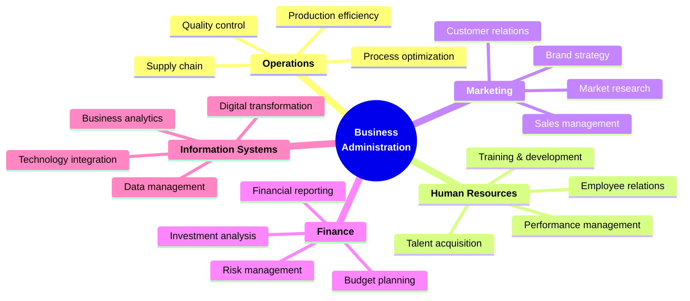

```mermaid
mindmap
  root((<b>Business<br>Administration</b>))
    <b>Operations</b>
      Process optimization
      Quality control
      Supply chain
      Production efficiency
    <b>Human Resources</b>
      Talent acquisition
      Training & development
      Performance management
      Employee relations
    <b>Marketing</b>
      Market research
      Brand strategy
      Customer relations
      Sales management
    <b>Finance</b>
      Budget planning
      Investment analysis
      Risk management
      Financial reporting
    <b>Information Systems</b>
      Data management
      Technology integration
      Business analytics
      Digital transformation
```

