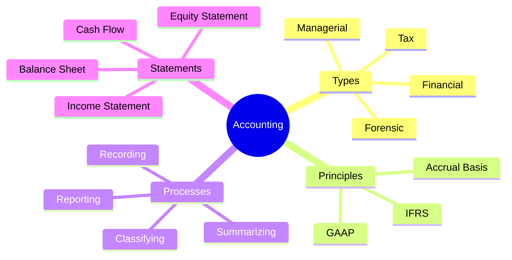

```mermaid
mindmap
  root((Accounting))
    Types
      Financial
      Managerial
      Tax
      Forensic
    Principles
      GAAP
      IFRS
      Accrual Basis
    Processes
      Recording
      Classifying
      Summarizing
      Reporting
    Statements
      Balance Sheet
      Income Statement
      Cash Flow
      Equity Statement
```

