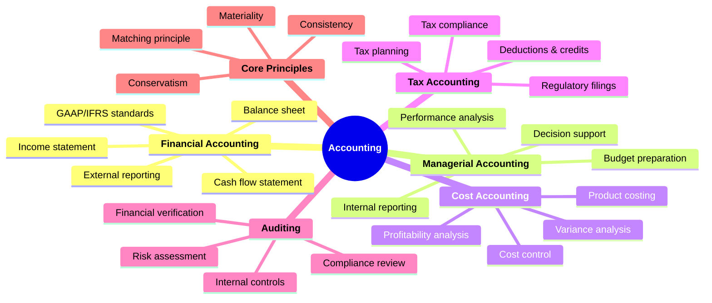

```mermaid
mindmap
  root((<b>Accounting</b>))
    <b>Financial Accounting</b>
      External reporting
      GAAP/IFRS standards
      Balance sheet
      Income statement
      Cash flow statement
    <b>Managerial Accounting</b>
      Internal reporting
      Budget preparation
      Performance analysis
      Decision support
    <b>Cost Accounting</b>
      Product costing
      Variance analysis
      Cost control
      Profitability analysis
    <b>Tax Accounting</b>
      Tax compliance
      Tax planning
      Deductions & credits
      Regulatory filings
    <b>Auditing</b>
      Financial verification
      Internal controls
      Compliance review
      Risk assessment
    <b>Core Principles</b>
      Matching principle
      Conservatism
      Consistency
      Materiality
```

