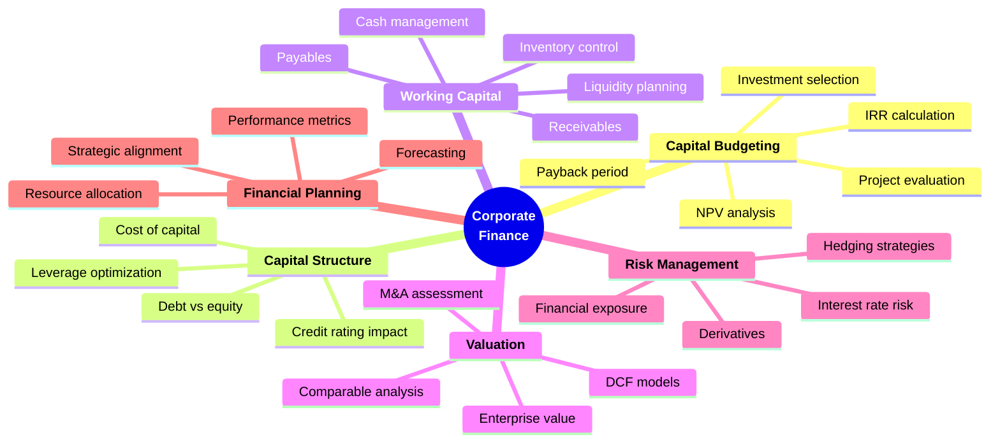

```mermaid
mindmap
  root((<b>Corporate<br>Finance</b>))
    <b>Capital Budgeting</b>
      Project evaluation
      NPV analysis
      IRR calculation
      Payback period
      Investment selection
    <b>Capital Structure</b>
      Debt vs equity
      Cost of capital
      Leverage optimization
      Credit rating impact
    <b>Working Capital</b>
      Cash management
      Inventory control
      Receivables
      Payables
      Liquidity planning
    <b>Valuation</b>
      DCF models
      Comparable analysis
      M&A assessment
      Enterprise value
    <b>Risk Management</b>
      Financial exposure
      Derivatives
      Hedging strategies
      Interest rate risk
    <b>Financial Planning</b>
      Forecasting
      Strategic alignment
      Resource allocation
      Performance metrics
```

