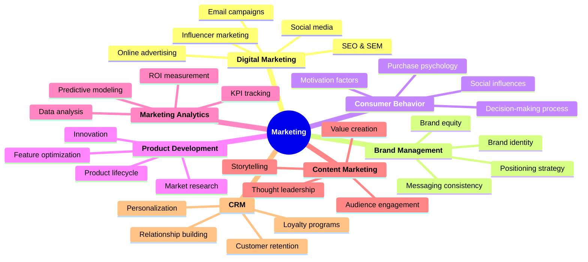

```mermaid
mindmap
  root((<b>Marketing</b>))
    <b>Digital Marketing</b>
      SEO & SEM
      Social media
      Email campaigns
      Influencer marketing
      Online advertising
    <b>Brand Management</b>
      Brand identity
      Brand equity
      Positioning strategy
      Messaging consistency
    <b>Consumer Behavior</b>
      Purchase psychology
      Decision-making process
      Social influences
      Motivation factors
    <b>Product Development</b>
      Market research
      Innovation
      Product lifecycle
      Feature optimization
    <b>Marketing Analytics</b>
      Data analysis
      KPI tracking
      ROI measurement
      Predictive modeling
    <b>Content Marketing</b>
      Storytelling
      Value creation
      Audience engagement
      Thought leadership
    <b>CRM</b>
      Customer retention
      Loyalty programs
      Personalization
      Relationship building
```

