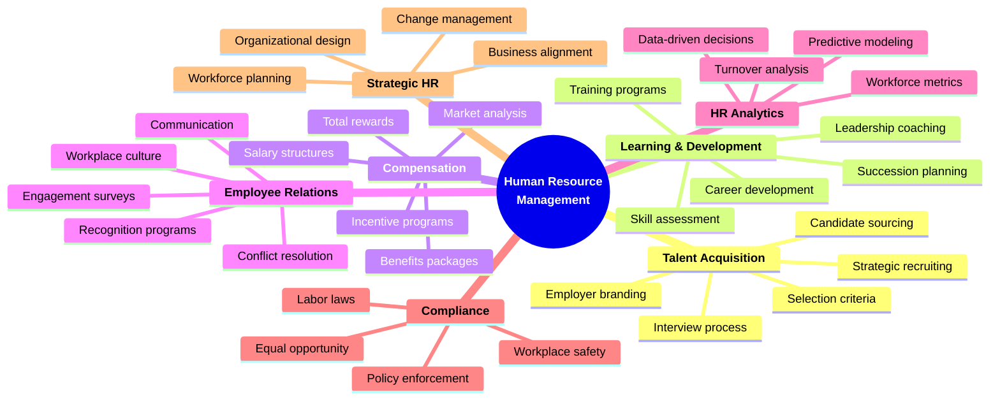

```mermaid
mindmap
  root((<b>Human Resource<br>Management</b>))
    <b>Talent Acquisition</b>
      Strategic recruiting
      Candidate sourcing
      Interview process
      Selection criteria
      Employer branding
    <b>Learning & Development</b>
      Training programs
      Career development
      Leadership coaching
      Skill assessment
      Succession planning
    <b>Compensation</b>
      Salary structures
      Incentive programs
      Benefits packages
      Total rewards
      Market analysis
    <b>Employee Relations</b>
      Workplace culture
      Conflict resolution
      Engagement surveys
      Recognition programs
      Communication
    <b>HR Analytics</b>
      Workforce metrics
      Turnover analysis
      Predictive modeling
      Data-driven decisions
    <b>Compliance</b>
      Labor laws
      Workplace safety
      Equal opportunity
      Policy enforcement
    <b>Strategic HR</b>
      Business alignment
      Organizational design
      Change management
      Workforce planning
```

