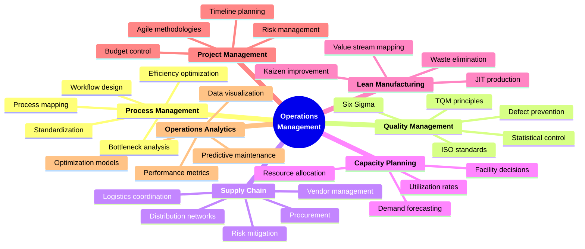

```mermaid
mindmap
  root((<b>Operations<br>Management</b>))
    <b>Process Management</b>
      Workflow design
      Process mapping
      Bottleneck analysis
      Efficiency optimization
      Standardization
    <b>Quality Management</b>
      TQM principles
      ISO standards
      Six Sigma
      Statistical control
      Defect prevention
    <b>Supply Chain</b>
      Procurement
      Logistics coordination
      Vendor management
      Distribution networks
      Risk mitigation
    <b>Capacity Planning</b>
      Demand forecasting
      Resource allocation
      Facility decisions
      Utilization rates
    <b>Lean Manufacturing</b>
      Waste elimination
      JIT production
      Value stream mapping
      Kaizen improvement
    <b>Project Management</b>
      Agile methodologies
      Timeline planning
      Budget control
      Risk management
    <b>Operations Analytics</b>
      Performance metrics
      Data visualization
      Predictive maintenance
      Optimization models
```

