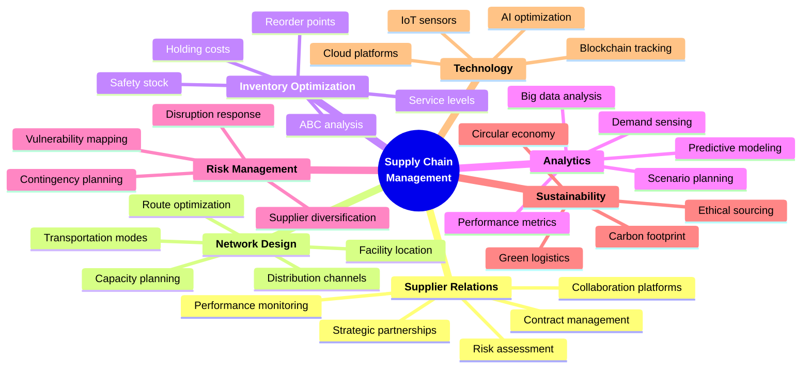

```mermaid
mindmap
  root((<b>Supply Chain<br>Management</b>))
    <b>Supplier Relations</b>
      Strategic partnerships
      Performance monitoring
      Collaboration platforms
      Risk assessment
      Contract management
    <b>Network Design</b>
      Facility location
      Transportation modes
      Distribution channels
      Route optimization
      Capacity planning
    <b>Inventory Optimization</b>
      Safety stock
      ABC analysis
      Reorder points
      Holding costs
      Service levels
    <b>Analytics</b>
      Demand sensing
      Predictive modeling
      Big data analysis
      Scenario planning
      Performance metrics
    <b>Risk Management</b>
      Vulnerability mapping
      Contingency planning
      Disruption response
      Supplier diversification
    <b>Sustainability</b>
      Circular economy
      Ethical sourcing
      Carbon footprint
      Green logistics
    <b>Technology</b>
      Blockchain tracking
      IoT sensors
      AI optimization
      Cloud platforms
```

