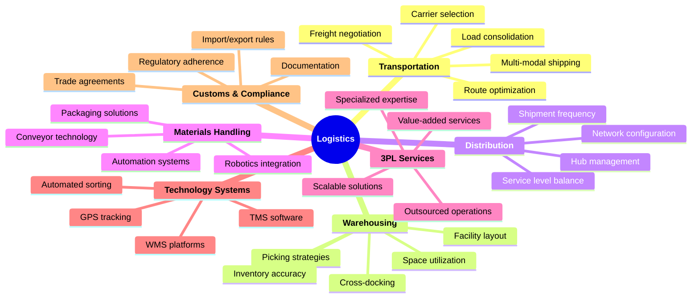

```mermaid
mindmap
  root((<b>Logistics</b>))
    <b>Transportation</b>
      Carrier selection
      Route optimization
      Load consolidation
      Freight negotiation
      Multi-modal shipping
    <b>Warehousing</b>
      Facility layout
      Picking strategies
      Cross-docking
      Inventory accuracy
      Space utilization
    <b>Distribution</b>
      Network configuration
      Shipment frequency
      Service level balance
      Hub management
    <b>Materials Handling</b>
      Automation systems
      Conveyor technology
      Robotics integration
      Packaging solutions
    <b>3PL Services</b>
      Outsourced operations
      Specialized expertise
      Scalable solutions
      Value-added services
    <b>Technology Systems</b>
      WMS platforms
      TMS software
      GPS tracking
      Automated sorting
    <b>Customs & Compliance</b>
      Regulatory adherence
      Documentation
      Trade agreements
      Import/export rules
```

