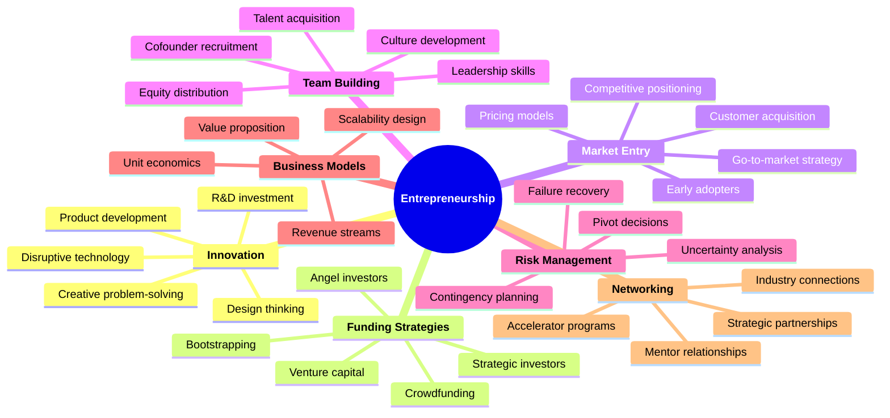

```mermaid
mindmap
  root((<b>Entrepreneurship</b>))
    <b>Innovation</b>
      Design thinking
      Disruptive technology
      Product development
      Creative problem-solving
      R&D investment
    <b>Funding Strategies</b>
      Bootstrapping
      Angel investors
      Venture capital
      Crowdfunding
      Strategic investors
    <b>Market Entry</b>
      Competitive positioning
      Customer acquisition
      Pricing models
      Go-to-market strategy
      Early adopters
    <b>Team Building</b>
      Cofounder recruitment
      Culture development
      Talent acquisition
      Leadership skills
      Equity distribution
    <b>Risk Management</b>
      Uncertainty analysis
      Contingency planning
      Pivot decisions
      Failure recovery
    <b>Business Models</b>
      Value proposition
      Revenue streams
      Scalability design
      Unit economics
    <b>Networking</b>
      Mentor relationships
      Strategic partnerships
      Industry connections
      Accelerator programs
```

