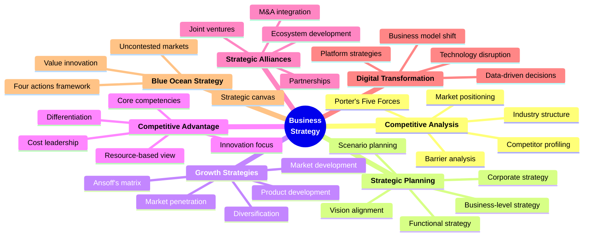

```mermaid
mindmap
  root((<b>Business<br>Strategy</b>))
    <b>Competitive Analysis</b>
      Porter's Five Forces
      Competitor profiling
      Market positioning
      Industry structure
      Barrier analysis
    <b>Strategic Planning</b>
      Corporate strategy
      Business-level strategy
      Functional strategy
      Scenario planning
      Vision alignment
    <b>Growth Strategies</b>
      Market penetration
      Product development
      Market development
      Diversification
      Ansoff's matrix
    <b>Competitive Advantage</b>
      Cost leadership
      Differentiation
      Innovation focus
      Resource-based view
      Core competencies
    <b>Strategic Alliances</b>
      Joint ventures
      M&A integration
      Partnerships
      Ecosystem development
    <b>Digital Transformation</b>
      Technology disruption
      Platform strategies
      Data-driven decisions
      Business model shift
    <b>Blue Ocean Strategy</b>
      Value innovation
      Uncontested markets
      Strategic canvas
      Four actions framework
```

