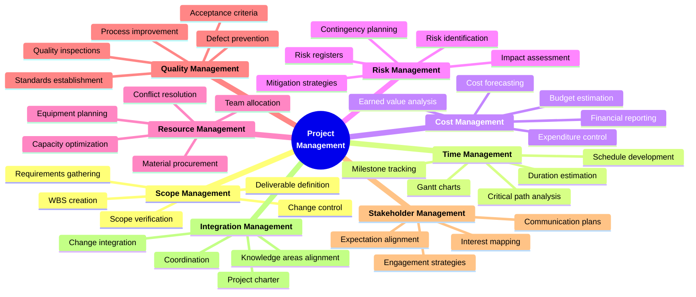

```mermaid
mindmap
  root((<b>Project<br>Management</b>))
    <b>Scope Management</b>
      Requirements gathering
      WBS creation
      Scope verification
      Change control
      Deliverable definition
    <b>Time Management</b>
      Schedule development
      Critical path analysis
      Gantt charts
      Milestone tracking
      Duration estimation
    <b>Cost Management</b>
      Budget estimation
      Expenditure control
      Cost forecasting
      Earned value analysis
      Financial reporting
    <b>Risk Management</b>
      Risk identification
      Impact assessment
      Mitigation strategies
      Risk registers
      Contingency planning
    <b>Resource Management</b>
      Team allocation
      Equipment planning
      Material procurement
      Capacity optimization
      Conflict resolution
    <b>Quality Management</b>
      Standards establishment
      Quality inspections
      Process improvement
      Defect prevention
      Acceptance criteria
    <b>Stakeholder Management</b>
      Interest mapping
      Expectation alignment
      Communication plans
      Engagement strategies
    <b>Integration Management</b>
      Project charter
      Coordination
      Knowledge areas alignment
      Change integration
```

