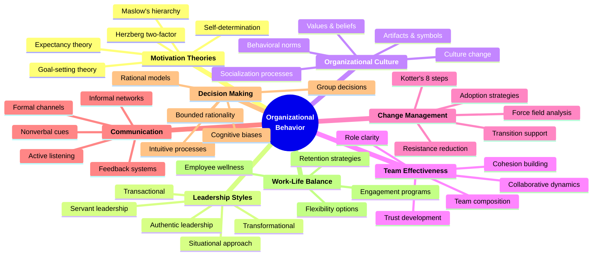

```mermaid
mindmap
  root((<b>Organizational<br>Behavior</b>))
    <b>Motivation Theories</b>
      Maslow's hierarchy
      Herzberg two-factor
      Expectancy theory
      Goal-setting theory
      Self-determination
    <b>Leadership Styles</b>
      Transformational
      Transactional
      Servant leadership
      Authentic leadership
      Situational approach
    <b>Organizational Culture</b>
      Values & beliefs
      Artifacts & symbols
      Behavioral norms
      Socialization processes
      Culture change
    <b>Team Effectiveness</b>
      Team composition
      Cohesion building
      Role clarity
      Trust development
      Collaborative dynamics
    <b>Change Management</b>
      Force field analysis
      Kotter's 8 steps
      Resistance reduction
      Adoption strategies
      Transition support
    <b>Communication</b>
      Formal channels
      Informal networks
      Active listening
      Feedback systems
      Nonverbal cues
    <b>Decision Making</b>
      Rational models
      Bounded rationality
      Intuitive processes
      Group decisions
      Cognitive biases
    <b>Work-Life Balance</b>
      Employee wellness
      Engagement programs
      Retention strategies
      Flexibility options
```

