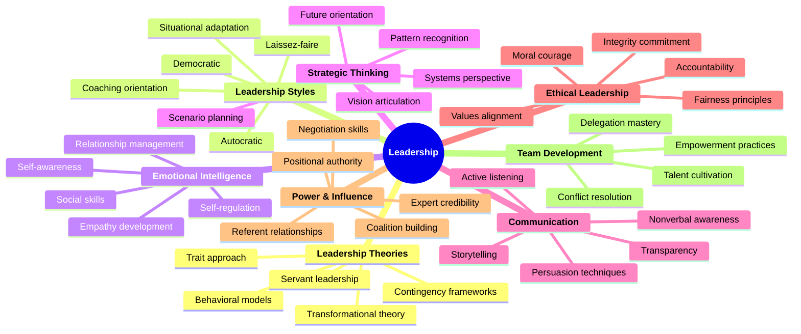

```mermaid
mindmap
  root((<b>Leadership</b>))
    <b>Leadership Theories</b>
      Trait approach
      Behavioral models
      Contingency frameworks
      Transformational theory
      Servant leadership
    <b>Leadership Styles</b>
      Autocratic
      Democratic
      Laissez-faire
      Coaching orientation
      Situational adaptation
    <b>Emotional Intelligence</b>
      Self-awareness
      Self-regulation
      Empathy development
      Social skills
      Relationship management
    <b>Strategic Thinking</b>
      Systems perspective
      Future orientation
      Pattern recognition
      Scenario planning
      Vision articulation
    <b>Communication</b>
      Active listening
      Storytelling
      Persuasion techniques
      Transparency
      Nonverbal awareness
    <b>Ethical Leadership</b>
      Integrity commitment
      Accountability
      Fairness principles
      Moral courage
      Values alignment
    <b>Power & Influence</b>
      Positional authority
      Expert credibility
      Referent relationships
      Coalition building
      Negotiation skills
    <b>Team Development</b>
      Talent cultivation
      Delegation mastery
      Conflict resolution
      Empowerment practices
```

