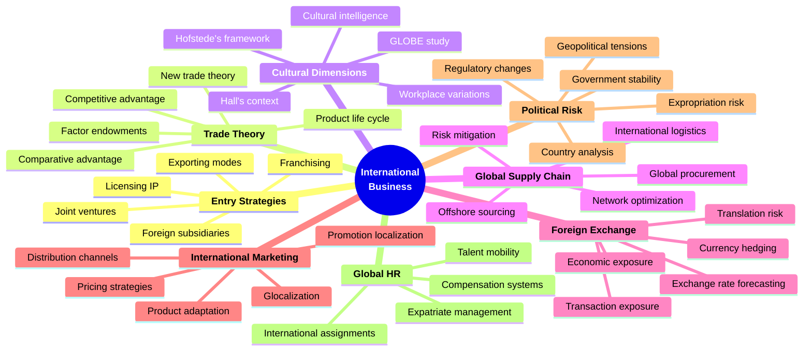

```mermaid
mindmap
  root((<b>International<br>Business</b>))
    <b>Entry Strategies</b>
      Exporting modes
      Licensing IP
      Franchising
      Joint ventures
      Foreign subsidiaries
    <b>Trade Theory</b>
      Comparative advantage
      Factor endowments
      Product life cycle
      New trade theory
      Competitive advantage
    <b>Cultural Dimensions</b>
      Hofstede's framework
      Hall's context
      GLOBE study
      Cultural intelligence
      Workplace variations
    <b>Global Supply Chain</b>
      International logistics
      Offshore sourcing
      Global procurement
      Risk mitigation
      Network optimization
    <b>Foreign Exchange</b>
      Currency hedging
      Exchange rate forecasting
      Transaction exposure
      Translation risk
      Economic exposure
    <b>International Marketing</b>
      Product adaptation
      Pricing strategies
      Distribution channels
      Promotion localization
      Glocalization
    <b>Political Risk</b>
      Government stability
      Regulatory changes
      Geopolitical tensions
      Expropriation risk
      Country analysis
    <b>Global HR</b>
      Expatriate management
      International assignments
      Compensation systems
      Talent mobility
```

