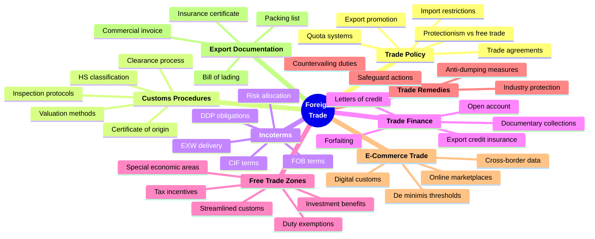

```mermaid
mindmap
  root((<b>Foreign<br>Trade</b>))
    <b>Trade Policy</b>
      Protectionism vs free trade
      Quota systems
      Import restrictions
      Export promotion
      Trade agreements
    <b>Customs Procedures</b>
      HS classification
      Certificate of origin
      Valuation methods
      Inspection protocols
      Clearance process
    <b>Incoterms</b>
      FOB terms
      CIF terms
      EXW delivery
      DDP obligations
      Risk allocation
    <b>Trade Finance</b>
      Letters of credit
      Documentary collections
      Open account
      Export credit insurance
      Forfaiting
    <b>Free Trade Zones</b>
      Tax incentives
      Duty exemptions
      Special economic areas
      Streamlined customs
      Investment benefits
    <b>Trade Remedies</b>
      Anti-dumping measures
      Countervailing duties
      Safeguard actions
      Industry protection
    <b>E-Commerce Trade</b>
      Digital customs
      Cross-border data
      Online marketplaces
      De minimis thresholds
    <b>Export Documentation</b>
      Commercial invoice
      Packing list
      Bill of lading
      Insurance certificate
```

