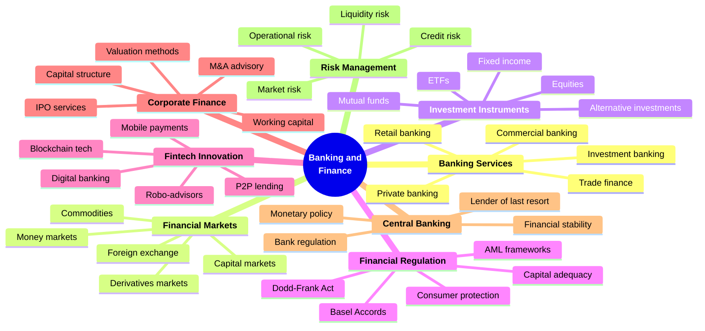

```mermaid
mindmap
  root((<b>Banking and<br>Finance</b>))
    <b>Banking Services</b>
      Retail banking
      Commercial banking
      Investment banking
      Private banking
      Trade finance
    <b>Financial Markets</b>
      Money markets
      Capital markets
      Foreign exchange
      Derivatives markets
      Commodities
    <b>Investment Instruments</b>
      Equities
      Fixed income
      Mutual funds
      ETFs
      Alternative investments
    <b>Financial Regulation</b>
      Basel Accords
      Capital adequacy
      Consumer protection
      AML frameworks
      Dodd-Frank Act
    <b>Fintech Innovation</b>
      Digital banking
      Blockchain tech
      Robo-advisors
      P2P lending
      Mobile payments
    <b>Corporate Finance</b>
      Capital structure
      Working capital
      Valuation methods
      M&A advisory
      IPO services
    <b>Central Banking</b>
      Monetary policy
      Bank regulation
      Financial stability
      Lender of last resort
    <b>Risk Management</b>
      Credit risk
      Market risk
      Operational risk
      Liquidity risk
```

