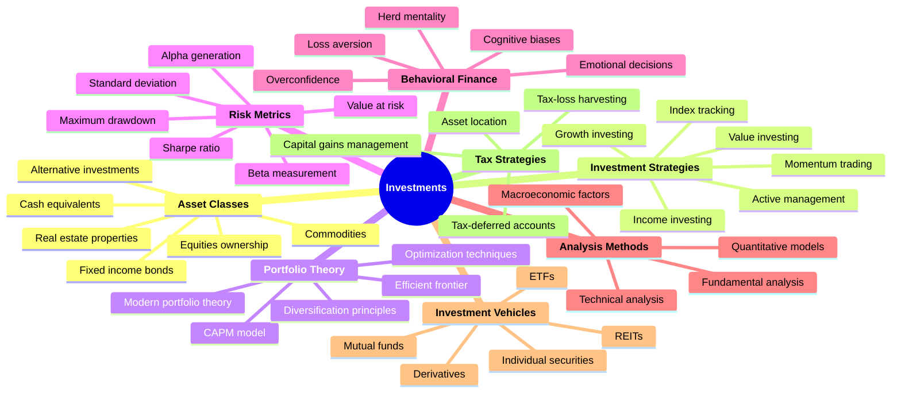

```mermaid
mindmap
  root((<b>Investments</b>))
    <b>Asset Classes</b>
      Equities ownership
      Fixed income bonds
      Real estate properties
      Commodities
      Alternative investments
      Cash equivalents
    <b>Investment Strategies</b>
      Value investing
      Growth investing
      Income investing
      Index tracking
      Active management
      Momentum trading
    <b>Portfolio Theory</b>
      Modern portfolio theory
      Efficient frontier
      CAPM model
      Diversification principles
      Optimization techniques
    <b>Risk Metrics</b>
      Beta measurement
      Alpha generation
      Sharpe ratio
      Standard deviation
      Value at risk
      Maximum drawdown
    <b>Behavioral Finance</b>
      Cognitive biases
      Herd mentality
      Emotional decisions
      Loss aversion
      Overconfidence
    <b>Analysis Methods</b>
      Fundamental analysis
      Technical analysis
      Quantitative models
      Macroeconomic factors
    <b>Investment Vehicles</b>
      Mutual funds
      ETFs
      Individual securities
      REITs
      Derivatives
    <b>Tax Strategies</b>
      Tax-loss harvesting
      Asset location
      Tax-deferred accounts
      Capital gains management
```

