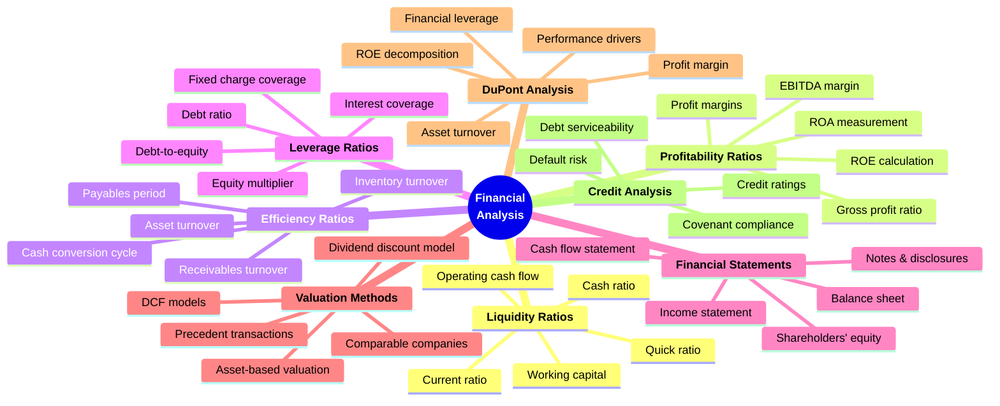

```mermaid
mindmap
  root((<b>Financial<br>Analysis</b>))
    <b>Liquidity Ratios</b>
      Current ratio
      Quick ratio
      Cash ratio
      Working capital
      Operating cash flow
    <b>Profitability Ratios</b>
      ROE calculation
      ROA measurement
      Profit margins
      EBITDA margin
      Gross profit ratio
    <b>Efficiency Ratios</b>
      Asset turnover
      Inventory turnover
      Receivables turnover
      Payables period
      Cash conversion cycle
    <b>Leverage Ratios</b>
      Debt-to-equity
      Interest coverage
      Debt ratio
      Equity multiplier
      Fixed charge coverage
    <b>Financial Statements</b>
      Balance sheet
      Income statement
      Cash flow statement
      Shareholders' equity
      Notes & disclosures
    <b>Valuation Methods</b>
      DCF models
      Comparable companies
      Precedent transactions
      Asset-based valuation
      Dividend discount model
    <b>DuPont Analysis</b>
      ROE decomposition
      Profit margin
      Asset turnover
      Financial leverage
      Performance drivers
    <b>Credit Analysis</b>
      Default risk
      Credit ratings
      Debt serviceability
      Covenant compliance
```

