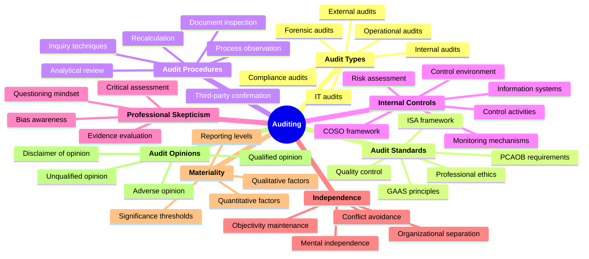

```mermaid
mindmap
  root((<b>Auditing</b>))
    <b>Audit Types</b>
      External audits
      Internal audits
      Compliance audits
      Forensic audits
      Operational audits
      IT audits
    <b>Audit Standards</b>
      GAAS principles
      ISA framework
      PCAOB requirements
      Professional ethics
      Quality control
    <b>Audit Procedures</b>
      Document inspection
      Process observation
      Third-party confirmation
      Recalculation
      Analytical review
      Inquiry techniques
    <b>Internal Controls</b>
      Control environment
      Risk assessment
      Information systems
      Control activities
      Monitoring mechanisms
      COSO framework
    <b>Professional Skepticism</b>
      Questioning mindset
      Critical assessment
      Evidence evaluation
      Bias awareness
    <b>Independence</b>
      Organizational separation
      Mental independence
      Conflict avoidance
      Objectivity maintenance
    <b>Materiality</b>
      Significance thresholds
      Quantitative factors
      Qualitative factors
      Reporting levels
    <b>Audit Opinions</b>
      Unqualified opinion
      Qualified opinion
      Adverse opinion
      Disclaimer of opinion
```

