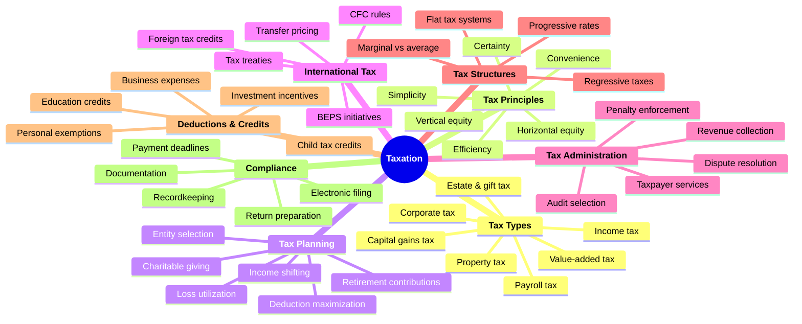

```mermaid
mindmap
  root((<b>Taxation</b>))
    <b>Tax Types</b>
      Income tax
      Corporate tax
      Value-added tax
      Property tax
      Capital gains tax
      Estate & gift tax
      Payroll tax
    <b>Tax Principles</b>
      Horizontal equity
      Vertical equity
      Efficiency
      Simplicity
      Certainty
      Convenience
    <b>Tax Planning</b>
      Income shifting
      Deduction maximization
      Entity selection
      Retirement contributions
      Charitable giving
      Loss utilization
    <b>International Tax</b>
      Transfer pricing
      Tax treaties
      Foreign tax credits
      CFC rules
      BEPS initiatives
    <b>Tax Administration</b>
      Revenue collection
      Taxpayer services
      Audit selection
      Dispute resolution
      Penalty enforcement
    <b>Tax Structures</b>
      Progressive rates
      Flat tax systems
      Regressive taxes
      Marginal vs average
    <b>Deductions & Credits</b>
      Business expenses
      Investment incentives
      Personal exemptions
      Education credits
      Child tax credits
    <b>Compliance</b>
      Return preparation
      Documentation
      Recordkeeping
      Payment deadlines
      Electronic filing
```

