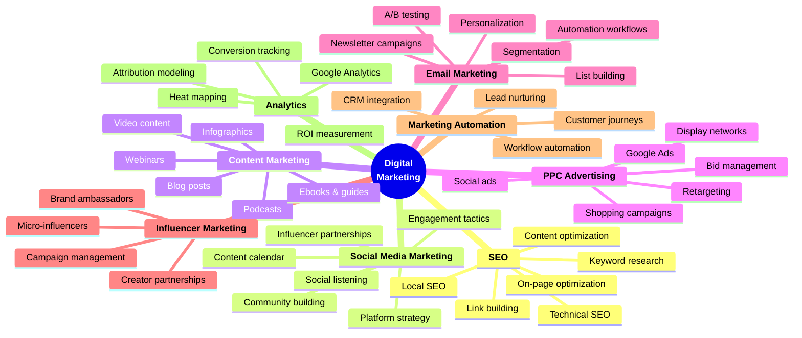

```mermaid
mindmap
  root((<b>Digital<br>Marketing</b>))
    <b>SEO</b>
      Keyword research
      On-page optimization
      Technical SEO
      Link building
      Local SEO
      Content optimization
    <b>Social Media Marketing</b>
      Platform strategy
      Community building
      Content calendar
      Engagement tactics
      Social listening
      Influencer partnerships
    <b>Content Marketing</b>
      Blog posts
      Video content
      Podcasts
      Infographics
      Ebooks & guides
      Webinars
    <b>PPC Advertising</b>
      Google Ads
      Social ads
      Display networks
      Retargeting
      Shopping campaigns
      Bid management
    <b>Email Marketing</b>
      Segmentation
      Automation workflows
      Personalization
      A/B testing
      List building
      Newsletter campaigns
    <b>Influencer Marketing</b>
      Creator partnerships
      Brand ambassadors
      Micro-influencers
      Campaign management
    <b>Marketing Automation</b>
      Lead nurturing
      Customer journeys
      Workflow automation
      CRM integration
    <b>Analytics</b>
      Google Analytics
      Conversion tracking
      Attribution modeling
      ROI measurement
      Heat mapping
```

