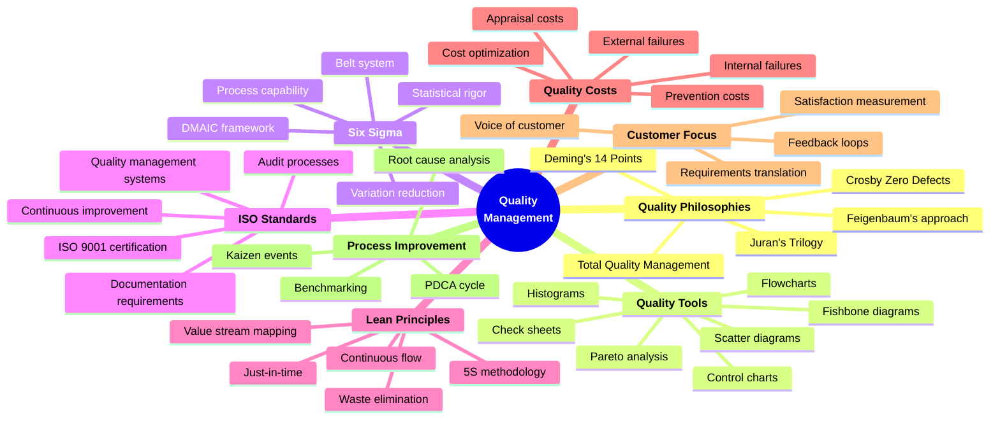

```mermaid
mindmap
  root((<b>Quality<br>Management</b>))
    <b>Quality Philosophies</b>
      Total Quality Management
      Deming's 14 Points
      Juran's Trilogy
      Crosby Zero Defects
      Feigenbaum's approach
    <b>Quality Tools</b>
      Control charts
      Pareto analysis
      Fishbone diagrams
      Flowcharts
      Check sheets
      Histograms
      Scatter diagrams
    <b>Six Sigma</b>
      DMAIC framework
      Statistical rigor
      Belt system
      Variation reduction
      Process capability
    <b>ISO Standards</b>
      ISO 9001 certification
      Quality management systems
      Documentation requirements
      Audit processes
      Continuous improvement
    <b>Lean Principles</b>
      Waste elimination
      Value stream mapping
      Just-in-time
      Continuous flow
      5S methodology
    <b>Quality Costs</b>
      Prevention costs
      Appraisal costs
      Internal failures
      External failures
      Cost optimization
    <b>Customer Focus</b>
      Voice of customer
      Satisfaction measurement
      Requirements translation
      Feedback loops
    <b>Process Improvement</b>
      Kaizen events
      PDCA cycle
      Root cause analysis
      Benchmarking
```

