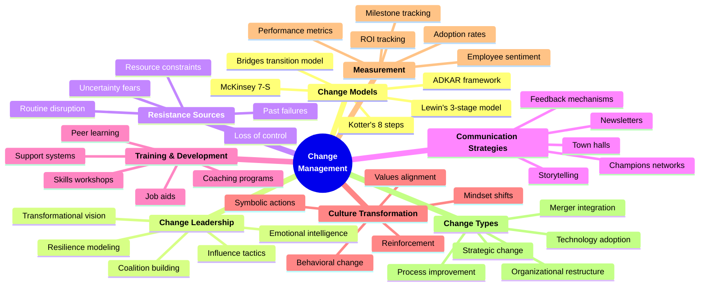

```mermaid
mindmap
  root((<b>Change<br>Management</b>))
    <b>Change Models</b>
      Lewin's 3-stage model
      Kotter's 8 steps
      ADKAR framework
      McKinsey 7-S
      Bridges transition model
    <b>Change Leadership</b>
      Transformational vision
      Emotional intelligence
      Coalition building
      Resilience modeling
      Influence tactics
    <b>Resistance Sources</b>
      Loss of control
      Uncertainty fears
      Routine disruption
      Past failures
      Resource constraints
    <b>Communication Strategies</b>
      Town halls
      Newsletters
      Champions networks
      Feedback mechanisms
      Storytelling
    <b>Training & Development</b>
      Skills workshops
      Coaching programs
      Job aids
      Support systems
      Peer learning
    <b>Culture Transformation</b>
      Mindset shifts
      Values alignment
      Behavioral change
      Symbolic actions
      Reinforcement
    <b>Measurement</b>
      Adoption rates
      Performance metrics
      Employee sentiment
      ROI tracking
      Milestone tracking
    <b>Change Types</b>
      Strategic change
      Process improvement
      Technology adoption
      Organizational restructure
      Merger integration
```

