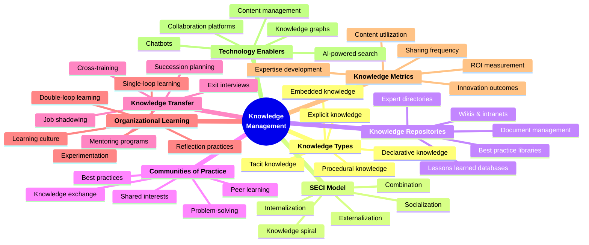

```mermaid
mindmap
  root((<b>Knowledge<br>Management</b>))
    <b>Knowledge Types</b>
      Explicit knowledge
      Tacit knowledge
      Embedded knowledge
      Procedural knowledge
      Declarative knowledge
    <b>SECI Model</b>
      Socialization
      Externalization
      Combination
      Internalization
      Knowledge spiral
    <b>Knowledge Repositories</b>
      Document management
      Wikis & intranets
      Lessons learned databases
      Expert directories
      Best practice libraries
    <b>Communities of Practice</b>
      Shared interests
      Knowledge exchange
      Problem-solving
      Best practices
      Peer learning
    <b>Knowledge Transfer</b>
      Mentoring programs
      Job shadowing
      Exit interviews
      Succession planning
      Cross-training
    <b>Organizational Learning</b>
      Single-loop learning
      Double-loop learning
      Learning culture
      Experimentation
      Reflection practices
    <b>Knowledge Metrics</b>
      Sharing frequency
      Content utilization
      Expertise development
      Innovation outcomes
      ROI measurement
    <b>Technology Enablers</b>
      Collaboration platforms
      AI-powered search
      Chatbots
      Knowledge graphs
      Content management
```

