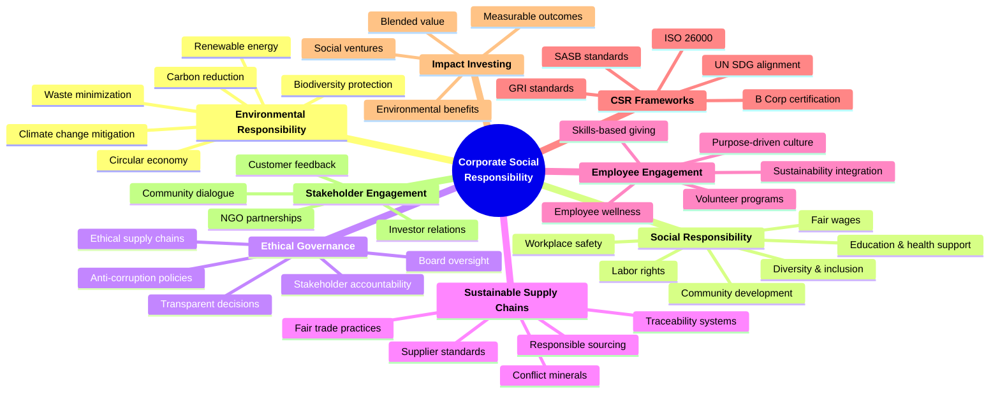

```mermaid
mindmap
  root((<b>Corporate Social<br>Responsibility</b>))
    <b>Environmental Responsibility</b>
      Climate change mitigation
      Carbon reduction
      Renewable energy
      Circular economy
      Waste minimization
      Biodiversity protection
    <b>Social Responsibility</b>
      Labor rights
      Workplace safety
      Diversity & inclusion
      Fair wages
      Community development
      Education & health support
    <b>Ethical Governance</b>
      Board oversight
      Anti-corruption policies
      Transparent decisions
      Stakeholder accountability
      Ethical supply chains
    <b>Sustainable Supply Chains</b>
      Responsible sourcing
      Supplier standards
      Conflict minerals
      Fair trade practices
      Traceability systems
    <b>Employee Engagement</b>
      Purpose-driven culture
      Volunteer programs
      Skills-based giving
      Sustainability integration
      Employee wellness
    <b>CSR Frameworks</b>
      GRI standards
      UN SDG alignment
      ISO 26000
      B Corp certification
      SASB standards
    <b>Impact Investing</b>
      Social ventures
      Environmental benefits
      Measurable outcomes
      Blended value
    <b>Stakeholder Engagement</b>
      Community dialogue
      Customer feedback
      Investor relations
      NGO partnerships
```

