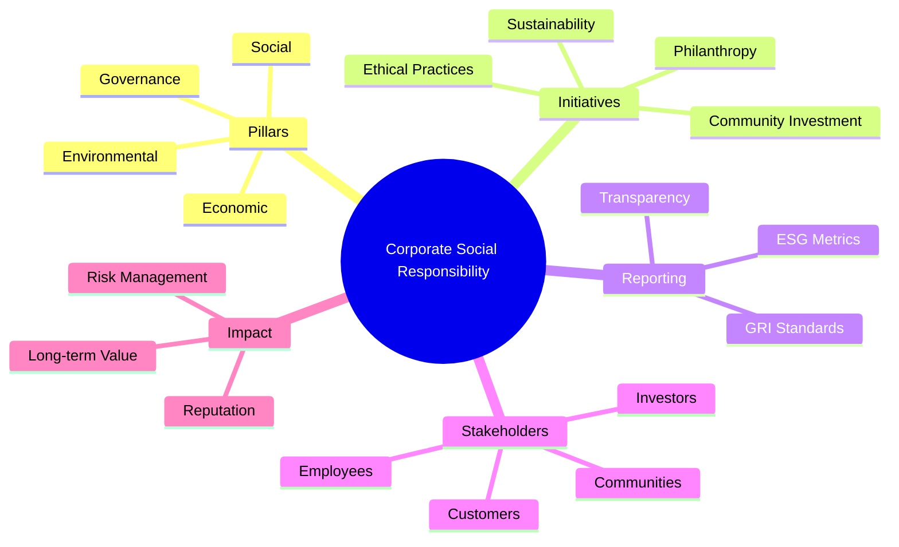

```mermaid
mindmap
  root((Corporate Social Responsibility))
    Pillars
      Economic
      Social
      Environmental
      Governance
    Initiatives
      Sustainability
      Community Investment
      Ethical Practices
      Philanthropy
    Reporting
      GRI Standards
      ESG Metrics
      Transparency
    Stakeholders
      Employees
      Customers
      Communities
      Investors
    Impact
      Reputation
      Risk Management
      Long-term Value
```

