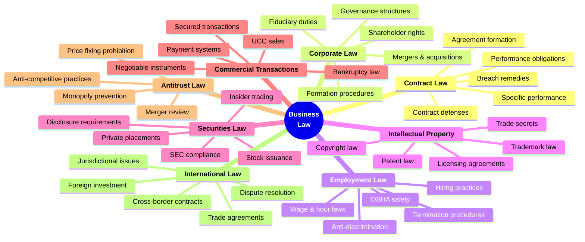

```mermaid
mindmap
  root((<b>Business<br>Law</b>))
    <b>Contract Law</b>
      Agreement formation
      Performance obligations
      Breach remedies
      Specific performance
      Contract defenses
    <b>Corporate Law</b>
      Formation procedures
      Governance structures
      Fiduciary duties
      Shareholder rights
      Mergers & acquisitions
    <b>Employment Law</b>
      Hiring practices
      Wage & hour laws
      OSHA safety
      Anti-discrimination
      Termination procedures
    <b>Intellectual Property</b>
      Patent law
      Trademark law
      Copyright law
      Trade secrets
      Licensing agreements
    <b>Securities Law</b>
      Stock issuance
      Disclosure requirements
      Insider trading
      SEC compliance
      Private placements
    <b>Commercial Transactions</b>
      UCC sales
      Negotiable instruments
      Secured transactions
      Bankruptcy law
      Payment systems
    <b>Antitrust Law</b>
      Monopoly prevention
      Price fixing prohibition
      Anti-competitive practices
      Merger review
    <b>International Law</b>
      Cross-border contracts
      Trade agreements
      Dispute resolution
      Jurisdictional issues
      Foreign investment
```

