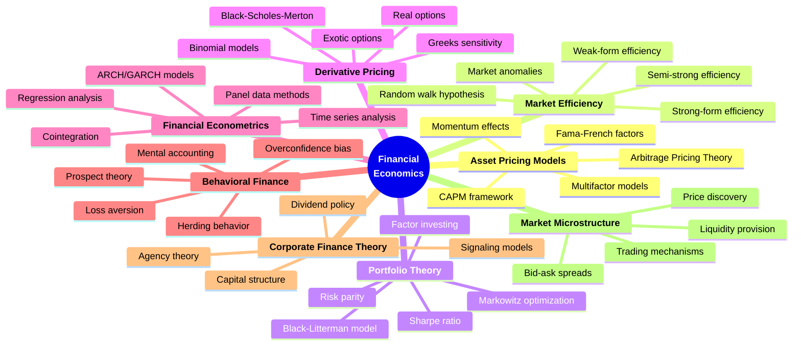

```mermaid
mindmap
  root((<b>Financial<br>Economics</b>))
    <b>Asset Pricing Models</b>
      CAPM framework
      Arbitrage Pricing Theory
      Fama-French factors
      Multifactor models
      Momentum effects
    <b>Market Efficiency</b>
      Weak-form efficiency
      Semi-strong efficiency
      Strong-form efficiency
      Random walk hypothesis
      Market anomalies
    <b>Portfolio Theory</b>
      Markowitz optimization
      Sharpe ratio
      Black-Litterman model
      Risk parity
      Factor investing
    <b>Derivative Pricing</b>
      Black-Scholes-Merton
      Binomial models
      Real options
      Exotic options
      Greeks sensitivity
    <b>Financial Econometrics</b>
      Time series analysis
      ARCH/GARCH models
      Cointegration
      Panel data methods
      Regression analysis
    <b>Behavioral Finance</b>
      Overconfidence bias
      Loss aversion
      Herding behavior
      Mental accounting
      Prospect theory
    <b>Corporate Finance Theory</b>
      Capital structure
      Dividend policy
      Agency theory
      Signaling models
    <b>Market Microstructure</b>
      Bid-ask spreads
      Liquidity provision
      Price discovery
      Trading mechanisms
```

