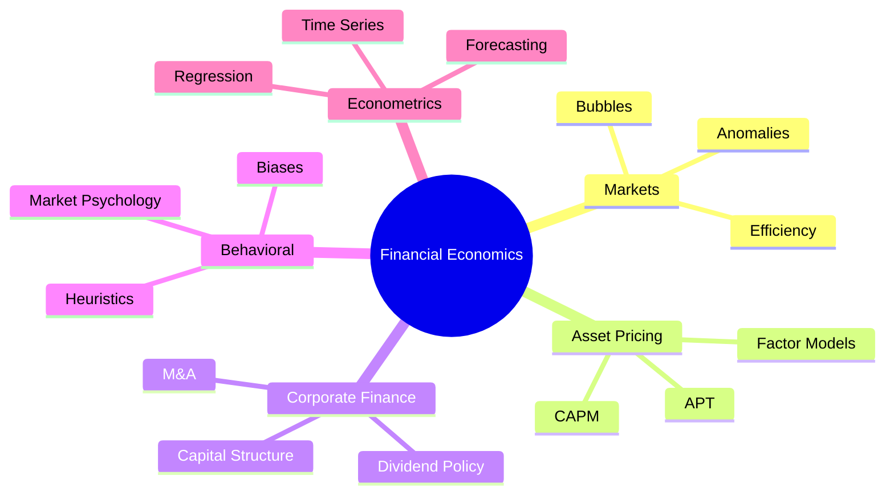

```mermaid
mindmap
  root((Financial Economics))
    Markets
      Efficiency
      Anomalies
      Bubbles
    Asset Pricing
      CAPM
      APT
      Factor Models
    Corporate Finance
      Capital Structure
      Dividend Policy
      M&A
    Behavioral
      Biases
      Heuristics
      Market Psychology
    Econometrics
      Time Series
      Regression
      Forecasting
```

