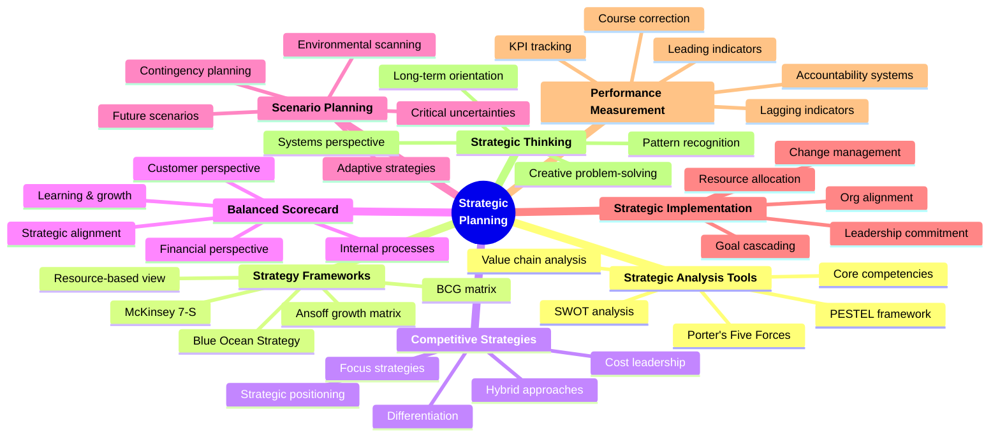

```mermaid
mindmap
  root((<b>Strategic<br>Planning</b>))
    <b>Strategic Analysis Tools</b>
      SWOT analysis
      Porter's Five Forces
      PESTEL framework
      Value chain analysis
      Core competencies
    <b>Strategy Frameworks</b>
      Ansoff growth matrix
      BCG matrix
      McKinsey 7-S
      Blue Ocean Strategy
      Resource-based view
    <b>Competitive Strategies</b>
      Cost leadership
      Differentiation
      Focus strategies
      Hybrid approaches
      Strategic positioning
    <b>Balanced Scorecard</b>
      Financial perspective
      Customer perspective
      Internal processes
      Learning & growth
      Strategic alignment
    <b>Scenario Planning</b>
      Future scenarios
      Critical uncertainties
      Adaptive strategies
      Contingency planning
      Environmental scanning
    <b>Strategic Implementation</b>
      Goal cascading
      Resource allocation
      Org alignment
      Change management
      Leadership commitment
    <b>Performance Measurement</b>
      Leading indicators
      Lagging indicators
      Accountability systems
      Course correction
      KPI tracking
    <b>Strategic Thinking</b>
      Systems perspective
      Long-term orientation
      Creative problem-solving
      Pattern recognition
```

