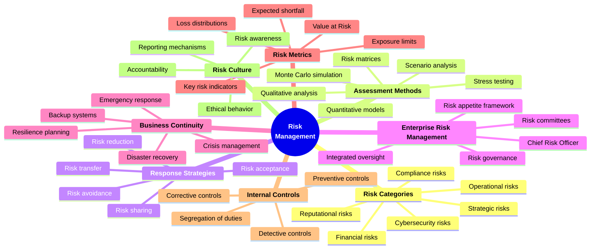

```mermaid
mindmap
  root((<b>Risk<br>Management</b>))
    <b>Risk Categories</b>
      Strategic risks
      Operational risks
      Financial risks
      Compliance risks
      Reputational risks
      Cybersecurity risks
    <b>Assessment Methods</b>
      Qualitative analysis
      Quantitative models
      Scenario analysis
      Stress testing
      Risk matrices
      Monte Carlo simulation
    <b>Response Strategies</b>
      Risk avoidance
      Risk reduction
      Risk transfer
      Risk acceptance
      Risk sharing
    <b>Enterprise Risk Management</b>
      Risk appetite framework
      Risk governance
      Chief Risk Officer
      Risk committees
      Integrated oversight
    <b>Business Continuity</b>
      Disaster recovery
      Crisis management
      Backup systems
      Emergency response
      Resilience planning
    <b>Risk Metrics</b>
      Value at Risk
      Expected shortfall
      Key risk indicators
      Loss distributions
      Exposure limits
    <b>Internal Controls</b>
      Preventive controls
      Detective controls
      Corrective controls
      Segregation of duties
    <b>Risk Culture</b>
      Risk awareness
      Accountability
      Ethical behavior
      Reporting mechanisms
```

