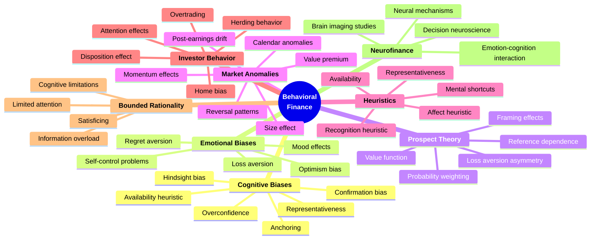

```mermaid
mindmap
  root((<b>Behavioral<br>Finance</b>))
    <b>Cognitive Biases</b>
      Overconfidence
      Anchoring
      Confirmation bias
      Availability heuristic
      Representativeness
      Hindsight bias
    <b>Emotional Biases</b>
      Loss aversion
      Regret aversion
      Self-control problems
      Mood effects
      Optimism bias
    <b>Prospect Theory</b>
      Reference dependence
      Loss aversion asymmetry
      Probability weighting
      Framing effects
      Value function
    <b>Market Anomalies</b>
      Momentum effects
      Value premium
      Size effect
      Calendar anomalies
      Post-earnings drift
      Reversal patterns
    <b>Heuristics</b>
      Representativeness
      Availability
      Affect heuristic
      Recognition heuristic
      Mental shortcuts
    <b>Investor Behavior</b>
      Disposition effect
      Herding behavior
      Overtrading
      Home bias
      Attention effects
    <b>Bounded Rationality</b>
      Cognitive limitations
      Satisficing
      Limited attention
      Information overload
    <b>Neurofinance</b>
      Brain imaging studies
      Neural mechanisms
      Emotion-cognition interaction
      Decision neuroscience
```

