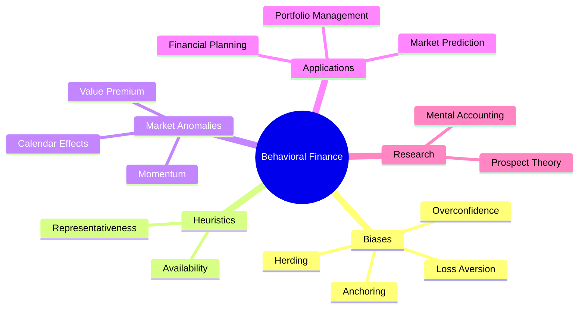

```mermaid
mindmap
  root((Behavioral Finance))
    Biases
      Overconfidence
      Anchoring
      Herding
      Loss Aversion
    Heuristics
      Availability
      Representativeness
    Market Anomalies
      Momentum
      Value Premium
      Calendar Effects
    Applications
      Portfolio Management
      Financial Planning
      Market Prediction
    Research
      Prospect Theory
      Mental Accounting
```

