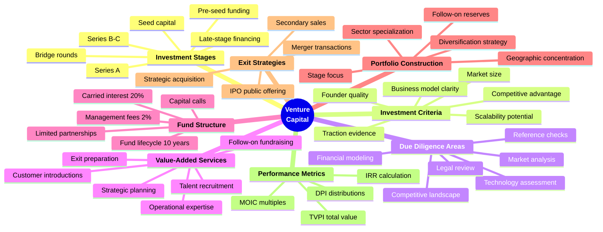

```mermaid
mindmap
  root((<b>Venture<br>Capital</b>))
    <b>Investment Stages</b>
      Pre-seed funding
      Seed capital
      Series A
      Series B-C
      Late-stage financing
      Bridge rounds
    <b>Investment Criteria</b>
      Founder quality
      Market size
      Competitive advantage
      Business model clarity
      Traction evidence
      Scalability potential
    <b>Due Diligence Areas</b>
      Technology assessment
      Market analysis
      Competitive landscape
      Financial modeling
      Legal review
      Reference checks
    <b>Value-Added Services</b>
      Strategic planning
      Operational expertise
      Talent recruitment
      Customer introductions
      Follow-on fundraising
      Exit preparation
    <b>Fund Structure</b>
      Limited partnerships
      Management fees 2%
      Carried interest 20%
      Fund lifecycle 10 years
      Capital calls
    <b>Portfolio Construction</b>
      Diversification strategy
      Stage focus
      Sector specialization
      Geographic concentration
      Follow-on reserves
    <b>Exit Strategies</b>
      IPO public offering
      Strategic acquisition
      Secondary sales
      Merger transactions
    <b>Performance Metrics</b>
      IRR calculation
      MOIC multiples
      DPI distributions
      TVPI total value
```

