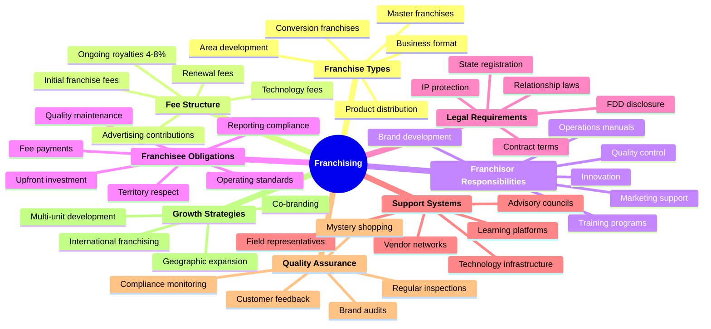

```mermaid
mindmap
  root((<b>Franchising</b>))
    <b>Franchise Types</b>
      Product distribution
      Business format
      Master franchises
      Conversion franchises
      Area development
    <b>Fee Structure</b>
      Initial franchise fees
      Ongoing royalties 4-8%
      Advertising contributions
      Technology fees
      Renewal fees
    <b>Franchisor Responsibilities</b>
      Brand development
      Operations manuals
      Training programs
      Marketing support
      Quality control
      Innovation
    <b>Franchisee Obligations</b>
      Upfront investment
      Operating standards
      Territory respect
      Quality maintenance
      Reporting compliance
      Fee payments
    <b>Legal Requirements</b>
      FDD disclosure
      State registration
      Relationship laws
      IP protection
      Contract terms
    <b>Support Systems</b>
      Field representatives
      Learning platforms
      Vendor networks
      Technology infrastructure
      Advisory councils
    <b>Quality Assurance</b>
      Mystery shopping
      Regular inspections
      Customer feedback
      Brand audits
      Compliance monitoring
    <b>Growth Strategies</b>
      Geographic expansion
      Multi-unit development
      International franchising
      Co-branding
```

