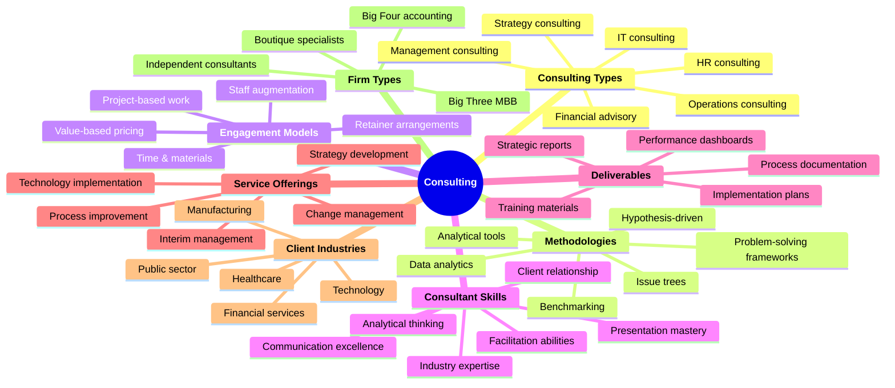

```mermaid
mindmap
  root((<b>Consulting</b>))
    <b>Consulting Types</b>
      Strategy consulting
      Management consulting
      IT consulting
      HR consulting
      Operations consulting
      Financial advisory
    <b>Methodologies</b>
      Problem-solving frameworks
      Issue trees
      Hypothesis-driven
      Analytical tools
      Benchmarking
      Data analytics
    <b>Engagement Models</b>
      Project-based work
      Retainer arrangements
      Staff augmentation
      Value-based pricing
      Time & materials
    <b>Consultant Skills</b>
      Analytical thinking
      Communication excellence
      Industry expertise
      Facilitation abilities
      Client relationship
      Presentation mastery
    <b>Deliverables</b>
      Strategic reports
      Implementation plans
      Training materials
      Performance dashboards
      Process documentation
    <b>Service Offerings</b>
      Strategy development
      Process improvement
      Change management
      Technology implementation
      Interim management
    <b>Client Industries</b>
      Healthcare
      Financial services
      Manufacturing
      Technology
      Public sector
    <b>Firm Types</b>
      Big Three MBB
      Big Four accounting
      Boutique specialists
      Independent consultants
```

