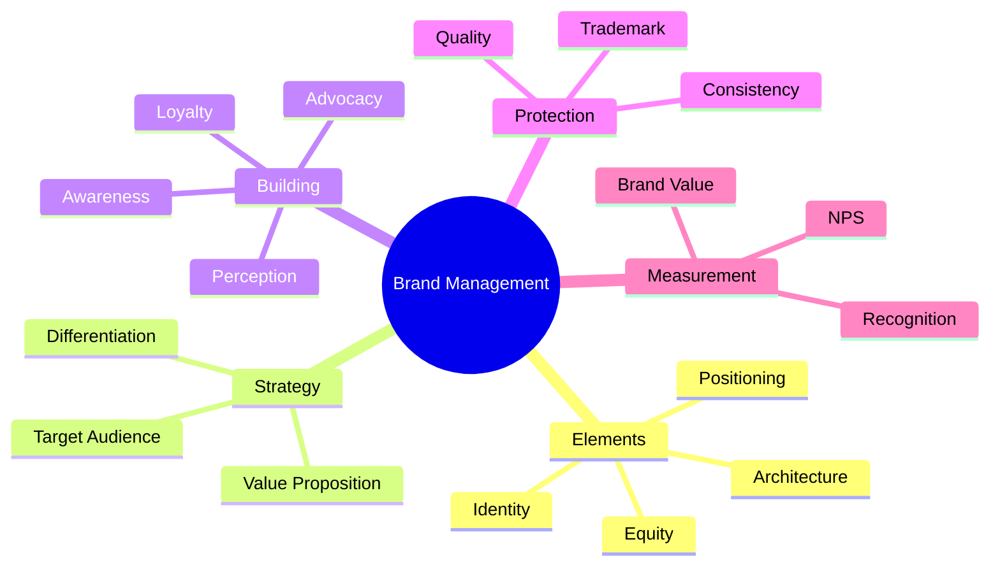

```mermaid
mindmap
  root((Brand Management))
    Elements
      Identity
      Positioning
      Equity
      Architecture
    Strategy
      Target Audience
      Value Proposition
      Differentiation
    Building
      Awareness
      Perception
      Loyalty
      Advocacy
    Protection
      Trademark
      Consistency
      Quality
    Measurement
      Brand Value
      NPS
      Recognition
```

