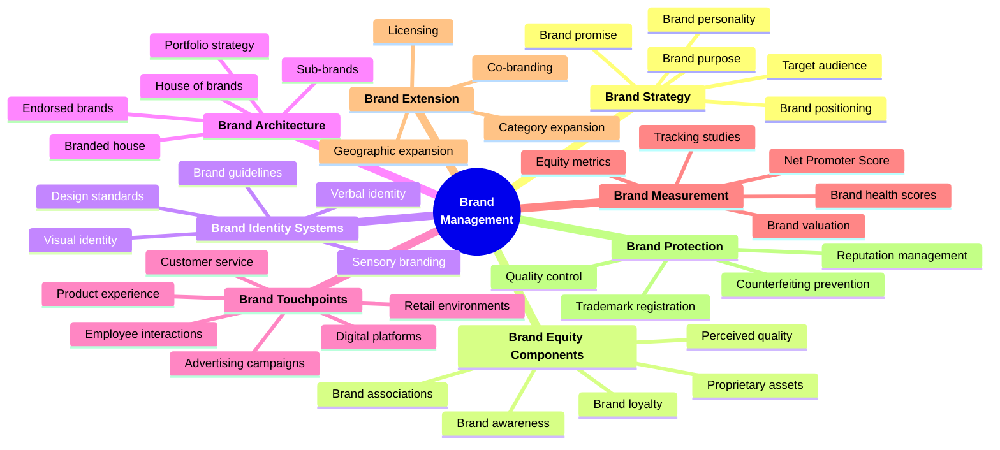

```mermaid
mindmap
  root((<b>Brand<br>Management</b>))
    <b>Brand Strategy</b>
      Brand positioning
      Brand personality
      Brand purpose
      Brand promise
      Target audience
    <b>Brand Equity Components</b>
      Brand awareness
      Brand associations
      Perceived quality
      Brand loyalty
      Proprietary assets
    <b>Brand Identity Systems</b>
      Visual identity
      Verbal identity
      Sensory branding
      Brand guidelines
      Design standards
    <b>Brand Architecture</b>
      Branded house
      House of brands
      Endorsed brands
      Sub-brands
      Portfolio strategy
    <b>Brand Touchpoints</b>
      Product experience
      Retail environments
      Digital platforms
      Advertising campaigns
      Customer service
      Employee interactions
    <b>Brand Measurement</b>
      Brand health scores
      Net Promoter Score
      Brand valuation
      Tracking studies
      Equity metrics
    <b>Brand Extension</b>
      Category expansion
      Co-branding
      Licensing
      Geographic expansion
    <b>Brand Protection</b>
      Trademark registration
      Counterfeiting prevention
      Quality control
      Reputation management
```

