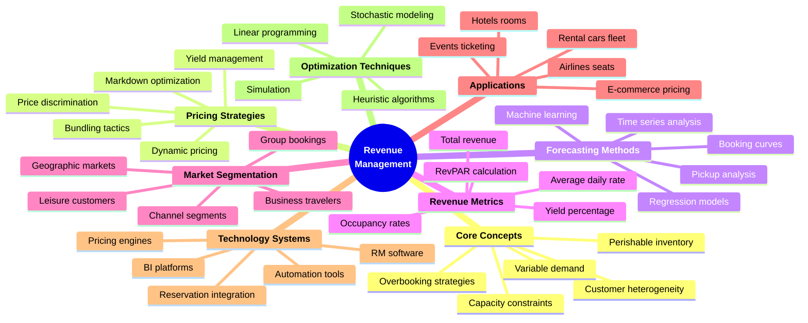

```mermaid
mindmap
  root((<b>Revenue<br>Management</b>))
    <b>Core Concepts</b>
      Perishable inventory
      Capacity constraints
      Variable demand
      Customer heterogeneity
      Overbooking strategies
    <b>Pricing Strategies</b>
      Dynamic pricing
      Yield management
      Price discrimination
      Bundling tactics
      Markdown optimization
    <b>Forecasting Methods</b>
      Time series analysis
      Regression models
      Machine learning
      Pickup analysis
      Booking curves
    <b>Revenue Metrics</b>
      RevPAR calculation
      Yield percentage
      Average daily rate
      Occupancy rates
      Total revenue
    <b>Market Segmentation</b>
      Business travelers
      Leisure customers
      Group bookings
      Channel segments
      Geographic markets
    <b>Applications</b>
      Airlines seats
      Hotels rooms
      Rental cars fleet
      Events ticketing
      E-commerce pricing
    <b>Technology Systems</b>
      RM software
      Pricing engines
      BI platforms
      Reservation integration
      Automation tools
    <b>Optimization Techniques</b>
      Linear programming
      Stochastic modeling
      Simulation
      Heuristic algorithms
```

