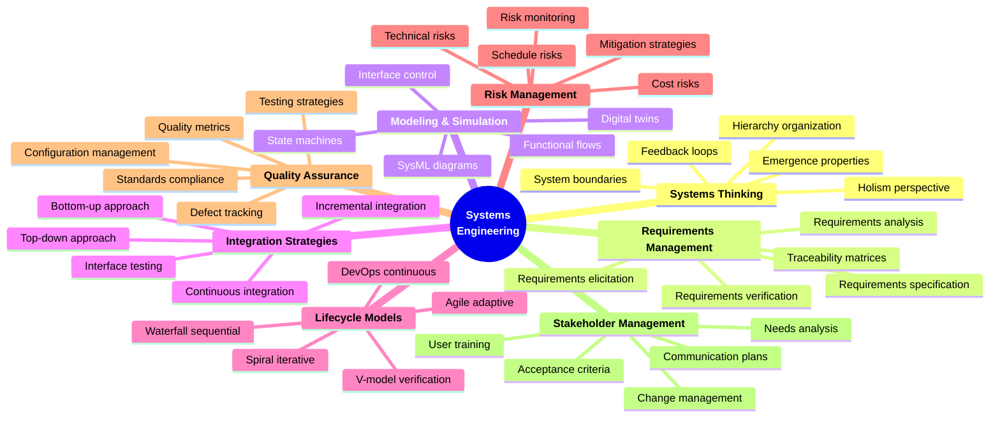

```mermaid
mindmap
  root((<b>Systems<br>Engineering</b>))
    <b>Systems Thinking</b>
      Holism perspective
      Emergence properties
      Hierarchy organization
      System boundaries
      Feedback loops
    <b>Requirements Management</b>
      Requirements elicitation
      Requirements analysis
      Requirements specification
      Requirements verification
      Traceability matrices
    <b>Modeling & Simulation</b>
      SysML diagrams
      Functional flows
      State machines
      Interface control
      Digital twins
    <b>Integration Strategies</b>
      Incremental integration
      Top-down approach
      Bottom-up approach
      Continuous integration
      Interface testing
    <b>Lifecycle Models</b>
      Waterfall sequential
      V-model verification
      Spiral iterative
      Agile adaptive
      DevOps continuous
    <b>Risk Management</b>
      Technical risks
      Schedule risks
      Cost risks
      Mitigation strategies
      Risk monitoring
    <b>Quality Assurance</b>
      Standards compliance
      Configuration management
      Testing strategies
      Defect tracking
      Quality metrics
    <b>Stakeholder Management</b>
      Needs analysis
      Communication plans
      Change management
      Acceptance criteria
      User training
```

