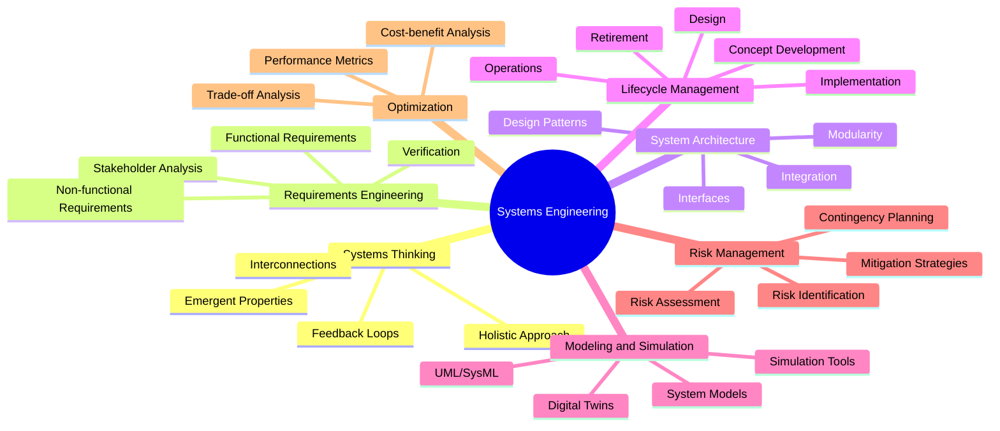

```mermaid
mindmap
  root((Systems Engineering))
    Systems Thinking
      Holistic Approach
      Emergent Properties
      Interconnections
      Feedback Loops
    Requirements Engineering
      Stakeholder Analysis
      Functional Requirements
      Non-functional Requirements
      Verification
    System Architecture
      Design Patterns
      Modularity
      Interfaces
      Integration
    Lifecycle Management
      Concept Development
      Design
      Implementation
      Operations
      Retirement
    Modeling and Simulation
      System Models
      UML/SysML
      Simulation Tools
      Digital Twins
    Risk Management
      Risk Identification
      Risk Assessment
      Mitigation Strategies
      Contingency Planning
    Optimization
      Trade-off Analysis
      Performance Metrics
      Cost-benefit Analysis
```

