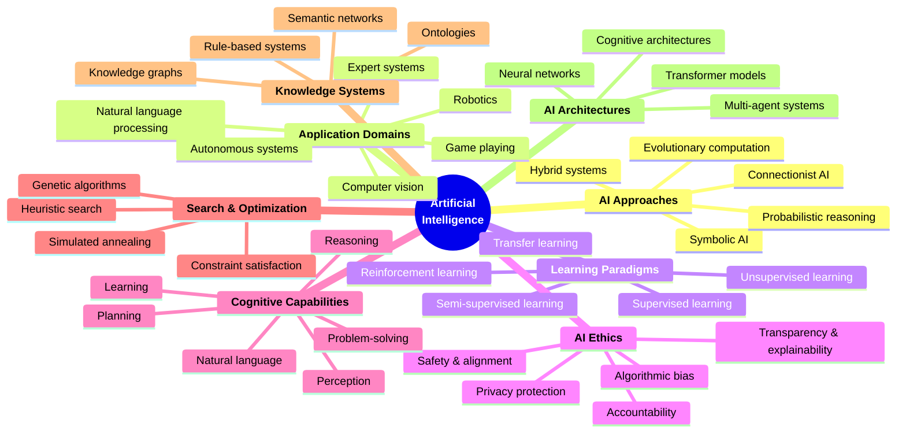

```mermaid
mindmap
  root((<b>Artificial<br>Intelligence</b>))
    <b>AI Approaches</b>
      Symbolic AI
      Connectionist AI
      Evolutionary computation
      Probabilistic reasoning
      Hybrid systems
    <b>Application Domains</b>
      Computer vision
      Natural language processing
      Robotics
      Expert systems
      Game playing
      Autonomous systems
    <b>Learning Paradigms</b>
      Supervised learning
      Unsupervised learning
      Reinforcement learning
      Semi-supervised learning
      Transfer learning
    <b>AI Ethics</b>
      Algorithmic bias
      Privacy protection
      Transparency & explainability
      Accountability
      Safety & alignment
    <b>Cognitive Capabilities</b>
      Perception
      Reasoning
      Learning
      Planning
      Natural language
      Problem-solving
    <b>Search & Optimization</b>
      Heuristic search
      Constraint satisfaction
      Genetic algorithms
      Simulated annealing
    <b>Knowledge Systems</b>
      Ontologies
      Semantic networks
      Rule-based systems
      Knowledge graphs
    <b>AI Architectures</b>
      Neural networks
      Transformer models
      Cognitive architectures
      Multi-agent systems
```

