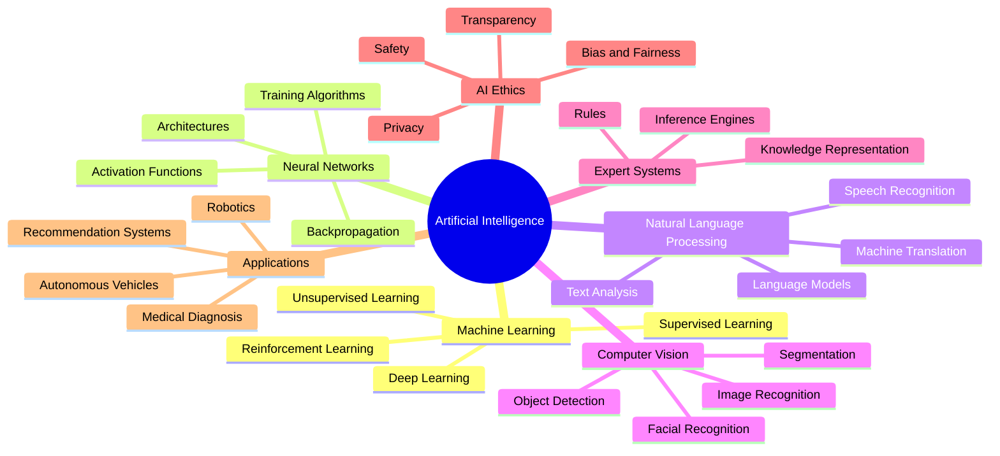

```mermaid
mindmap
  root((Artificial Intelligence))
    Machine Learning
      Supervised Learning
      Unsupervised Learning
      Reinforcement Learning
      Deep Learning
    Neural Networks
      Architectures
      Training Algorithms
      Activation Functions
      Backpropagation
    Natural Language Processing
      Text Analysis
      Language Models
      Machine Translation
      Speech Recognition
    Computer Vision
      Image Recognition
      Object Detection
      Segmentation
      Facial Recognition
    Expert Systems
      Knowledge Representation
      Inference Engines
      Rules
    AI Ethics
      Bias and Fairness
      Privacy
      Transparency
      Safety
    Applications
      Autonomous Vehicles
      Medical Diagnosis
      Recommendation Systems
      Robotics
```

