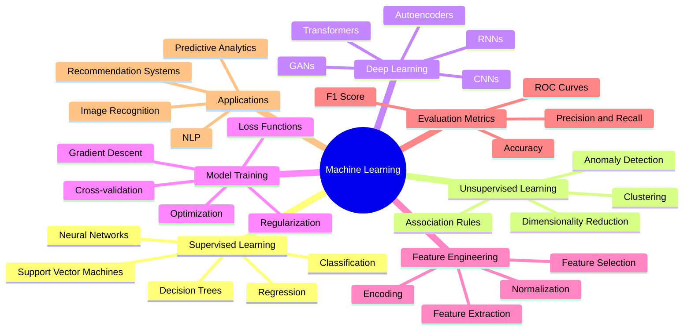

```mermaid
mindmap
  root((Machine Learning))
    Supervised Learning
      Classification
      Regression
      Decision Trees
      Support Vector Machines
      Neural Networks
    Unsupervised Learning
      Clustering
      Dimensionality Reduction
      Association Rules
      Anomaly Detection
    Deep Learning
      CNNs
      RNNs
      Transformers
      GANs
      Autoencoders
    Model Training
      Loss Functions
      Optimization
      Gradient Descent
      Regularization
      Cross-validation
    Feature Engineering
      Feature Selection
      Feature Extraction
      Normalization
      Encoding
    Evaluation Metrics
      Accuracy
      Precision and Recall
      F1 Score
      ROC Curves
    Applications
      Predictive Analytics
      Image Recognition
      NLP
      Recommendation Systems
```

