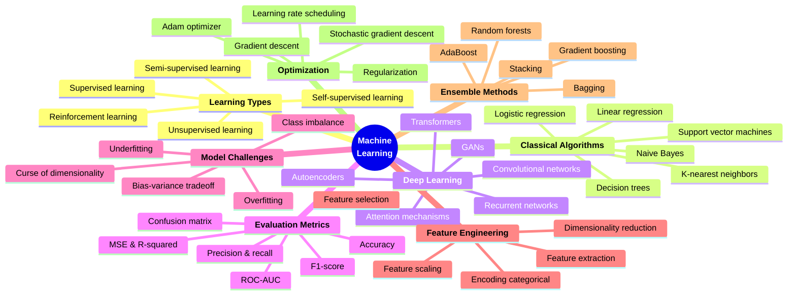

```mermaid
mindmap
  root((<b>Machine<br>Learning</b>))
    <b>Learning Types</b>
      Supervised learning
      Unsupervised learning
      Reinforcement learning
      Semi-supervised learning
      Self-supervised learning
    <b>Classical Algorithms</b>
      Linear regression
      Logistic regression
      Decision trees
      Support vector machines
      K-nearest neighbors
      Naive Bayes
    <b>Deep Learning</b>
      Convolutional networks
      Recurrent networks
      Transformers
      GANs
      Autoencoders
      Attention mechanisms
    <b>Evaluation Metrics</b>
      Accuracy
      Precision & recall
      F1-score
      ROC-AUC
      MSE & R-squared
      Confusion matrix
    <b>Model Challenges</b>
      Overfitting
      Underfitting
      Bias-variance tradeoff
      Curse of dimensionality
      Class imbalance
    <b>Feature Engineering</b>
      Feature selection
      Feature extraction
      Dimensionality reduction
      Feature scaling
      Encoding categorical
    <b>Ensemble Methods</b>
      Random forests
      Gradient boosting
      Bagging
      Stacking
      AdaBoost
    <b>Optimization</b>
      Gradient descent
      Stochastic gradient descent
      Adam optimizer
      Learning rate scheduling
      Regularization
```

