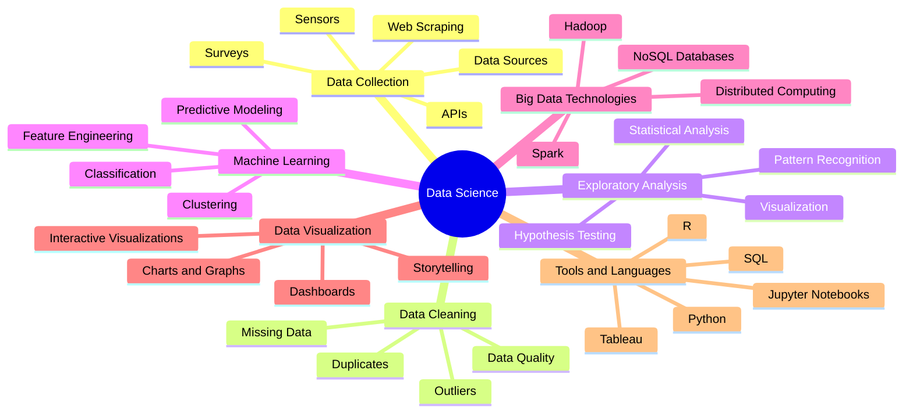

```mermaid
mindmap
  root((Data Science))
    Data Collection
      Data Sources
      Web Scraping
      APIs
      Sensors
      Surveys
    Data Cleaning
      Missing Data
      Outliers
      Duplicates
      Data Quality
    Exploratory Analysis
      Statistical Analysis
      Visualization
      Pattern Recognition
      Hypothesis Testing
    Machine Learning
      Predictive Modeling
      Classification
      Clustering
      Feature Engineering
    Big Data Technologies
      Hadoop
      Spark
      NoSQL Databases
      Distributed Computing
    Data Visualization
      Charts and Graphs
      Dashboards
      Interactive Visualizations
      Storytelling
    Tools and Languages
      Python
      R
      SQL
      Jupyter Notebooks
      Tableau
```

