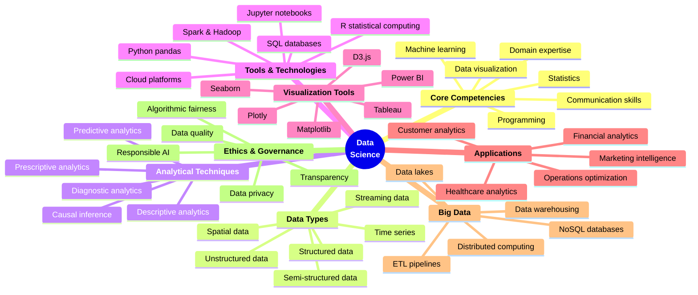

```mermaid
mindmap
  root((<b>Data<br>Science</b>))
    <b>Core Competencies</b>
      Statistics
      Programming
      Machine learning
      Data visualization
      Domain expertise
      Communication skills
    <b>Data Types</b>
      Structured data
      Semi-structured data
      Unstructured data
      Time series
      Streaming data
      Spatial data
    <b>Analytical Techniques</b>
      Descriptive analytics
      Diagnostic analytics
      Predictive analytics
      Prescriptive analytics
      Causal inference
    <b>Tools & Technologies</b>
      Python pandas
      R statistical computing
      SQL databases
      Spark & Hadoop
      Cloud platforms
      Jupyter notebooks
    <b>Visualization Tools</b>
      Tableau
      Power BI
      Matplotlib
      Seaborn
      D3.js
      Plotly
    <b>Applications</b>
      Customer analytics
      Financial analytics
      Healthcare analytics
      Operations optimization
      Marketing intelligence
    <b>Big Data</b>
      Distributed computing
      Data lakes
      NoSQL databases
      Data warehousing
      ETL pipelines
    <b>Ethics & Governance</b>
      Data privacy
      Algorithmic fairness
      Transparency
      Responsible AI
      Data quality
```

