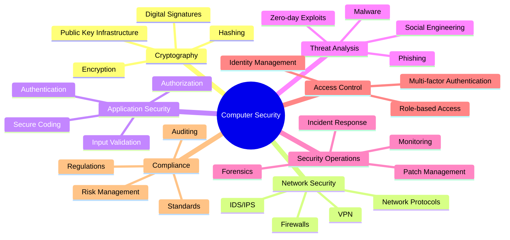

```mermaid
mindmap
  root((Computer Security))
    Cryptography
      Encryption
      Hashing
      Digital Signatures
      Public Key Infrastructure
    Network Security
      Firewalls
      IDS/IPS
      VPN
      Network Protocols
    Application Security
      Secure Coding
      Input Validation
      Authentication
      Authorization
    Threat Analysis
      Malware
      Phishing
      Social Engineering
      Zero-day Exploits
    Security Operations
      Monitoring
      Incident Response
      Forensics
      Patch Management
    Access Control
      Identity Management
      Multi-factor Authentication
      Role-based Access
    Compliance
      Regulations
      Standards
      Auditing
      Risk Management
```

